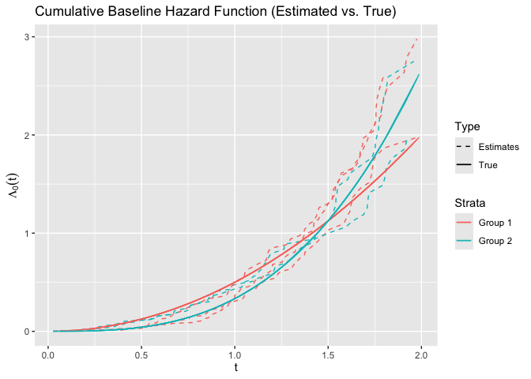

<!-- README.md is generated from README.Rmd. Please edit that file -->

# survtrans

<!-- badges: start -->

[](https://lifecycle.r-lib.org/articles/stages.html#experimental)
[](https://CRAN.R-project.org/package=survtrans)
[](https://github.com/SignorinoY/survtrans/actions/workflows/R-CMD-check.yaml)
[](https://app.codecov.io/gh/SignorinoY/survtrans)
<!-- badges: end -->

The goal of survtrans is to provide a framework for transferring
survival information from source domain(s) to target domain. The package
now only supports the Cox proportional hazards model with global and
local transfer learning.

## Installation

You can install the development version of survtrans like so:

``` r
# install.packages("pak")
pak::pak("SignorinoY/survtrans")
```

## Example

This is a basic example which shows you how to transfer survival
information from multiple source domains to a target domain using the
Cox proportional hazards model:

``` r
library(survtrans)
formula <- survival::Surv(time, status) ~ . - group - id
fit <- coxtrans(
  formula, sim2, sim2$group,
  lambda1 = 0.03, lambda2 = 0.01, lambda3 = 0.01, penalty = "SCAD"
)
summary(fit)
#> Call:
#> coxtrans(formula = formula, data = sim2, group = sim2$group, 
#>     lambda1 = 0.03, lambda2 = 0.01, lambda3 = 0.01, penalty = "SCAD")
#> 
#>   n=500, number of events=422
#> 
#>               coef exp(coef) se(coef)      z Pr(>|z|)    
#> X1 (1)     0.34792   1.41612  0.05132  6.780 1.20e-11 ***
#> X1 (2, 4)  0.94905   2.58324  0.08581 11.060  < 2e-16 ***
#> X1 (3, 5) -0.25320   0.77631  0.06876 -3.682 0.000231 ***
#> X2 (1)     0.36097   1.43472  0.05384  6.704 2.03e-11 ***
#> X2 (2, 4)  0.96453   2.62354  0.08501 11.345  < 2e-16 ***
#> X2 (3, 5) -0.24258   0.78460  0.08010 -3.029 0.002457 ** 
#> X3 (ALL)   0.34501   1.41200  0.05563  6.202 5.58e-10 ***
#> X4 (ALL)   0.32763   1.38767  0.05372  6.099 1.07e-09 ***
#> ---
#> Signif. codes:  0 '***' 0.001 '**' 0.01 '*' 0.05 '.' 0.1 ' ' 1
#>           exp(coef) exp(-coef) lower .95 upper .95
#> X1 (1)    1.4161    0.7062     1.2806    1.5660   
#> X1 (2, 4) 2.5832    0.3871     2.1834    3.0564   
#> X1 (3, 5) 0.7763    1.2881     0.6784    0.8883   
#> X2 (1)    1.4347    0.6970     1.2910    1.5944   
#> X2 (2, 4) 2.6235    0.3812     2.2209    3.0992   
#> X2 (3, 5) 0.7846    1.2745     0.6706    0.9180   
#> X3 (ALL)  1.4120    0.7082     1.2661    1.5747   
#> X4 (ALL)  1.3877    0.7206     1.2490    1.5417
```

We can also give the estimated cumulative hazard function as follows:

``` r
library(ggplot2)
basehaz_pred <- basehaz(fit)
basehaz_pred$color <- ifelse(
  as.numeric(basehaz_pred$strata) %% 2 == 0, "Group 2", "Group 1"
)
ggplot(
  basehaz_pred,
  aes(
    x = time,
    y = basehaz,
    group = strata,
    color = factor(color),
    linetype = "Estimates"
  )
) +
  geom_line() +
  geom_line(
    aes(x = time, y = time^2 / 2, color = "Group 1", linetype = "True")
  ) +
  geom_line(
    aes(x = time, y = time^3 / 3, color = "Group 2", linetype = "True")
  ) +
  labs(
    title = "Cumulative Baseline Hazard Function (Estimated vs. True)",
    x = expression(t),
    y = expression(Lambda[0](t))
  ) +
  scale_linetype_manual(values = c("Estimates" = "dashed", "True" = "solid")) +
  guides(
    color = guide_legend(title = "Strata"),
    linetype = guide_legend(title = "Type")
  )
```


